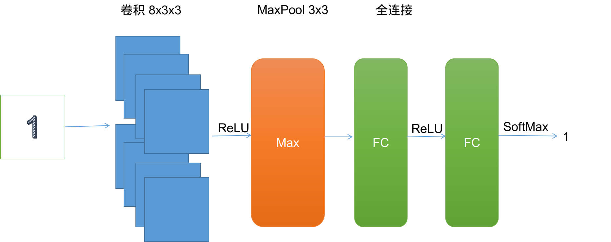
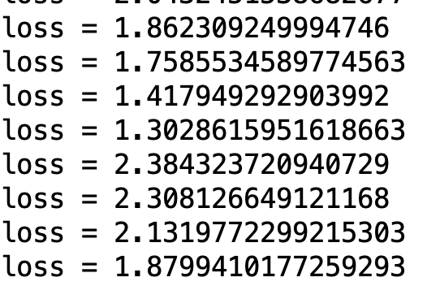
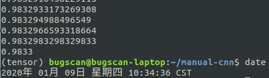

## 模式识别期末实验

### 邹永浩 2019211168

#### 1. 数据读取

直接使用前两次实验的数据读取工具

#### 2.卷积相关函数(convolution.py)

首先是卷积操作，根据`filter`和步长对原图片进行计算

```python
def convolution(image, filter_, bias, stride=1):
    (filters, filter_size, _) = filter_.shape
    in_dim, _ = image.shape
    out_dim = int((in_dim - filter_size) / stride) + 1
    out = np.zeros((filters, out_dim, out_dim))
    for curr_filter in range(filters):
        curr_y = out_y = 0
        while curr_y + filter_size <= in_dim:
            curr_x = out_x = 0
            while curr_x + filter_size <= in_dim:
                out[curr_filter, out_y, out_x] = np.sum(filter_[curr_filter] \
                 * image[curr_y:curr_y + filter_size, curr_x:curr_x + filter_size])\
                 + bias[curr_filter]
                curr_x += stride
                out_x += 1
            curr_y += stride
            out_y += 1
    return out

def convolution_backward(dconv_prev, conv_in, filter_, stride=1):
    (filters, filter_size, _) = filter_.shape
    (orig_dim, _) = conv_in.shape
    dout = np.zeros(conv_in.shape)
    dfilt = np.zeros(filter_.shape)
    dbias = np.zeros((filters, 1))
    for curr_f in range(filters):
        curr_y = out_y = 0
        while curr_y + filter_size <= orig_dim:
            curr_x = out_x = 0
            while curr_x + filter_size <= orig_dim:
                dfilt[curr_f] += dconv_prev[curr_f, out_y, out_x] * conv_in[curr_y:curr_y + filter_size, curr_x:curr_x + filter_size]
                dout[curr_y:curr_y + filter_size, curr_x:curr_x + filter_size] += dconv_prev[curr_f, out_y, out_x] * filter_[curr_f]
                curr_x += stride
                out_x += 1
            curr_y += stride
            out_y += 1
        dbias[curr_f] = np.sum(dconv_prev[curr_f])

    return dout, dfilt, dbias
```

然后是`maxpool`函数，相当于降维的函数

```python
def maxpool(image, filter_size=2, stride=2):
    image_depth, image_height, image_width = image.shape

    h = int((image_height - filter_size) / stride) + 1
    w = int((image_width - filter_size) / stride) + 1

    downscaled = np.zeros((image_depth, h, w))
    for i in range(image_depth):
        curr_y = out_y = 0
        while curr_y + filter_size <= image_height:
            curr_x = out_x = 0
            while curr_x + filter_size <= image_width:
                downscaled[i, out_y, out_x] = np.max(image[i, curr_y:curr_y + filter_size, curr_x:curr_x + filter_size])
                curr_x += stride
                out_x += 1
            curr_y += stride
            out_y += 1
    return downscaled

def maxpool_backward(dpool, orig, filter_size, s):
    (n_c, orig_dim, _) = orig.shape

    dout = np.zeros(orig.shape)

    for curr_c in range(n_c):
        curr_y = out_y = 0
        while curr_y + filter_size <= orig_dim:
            curr_x = out_x = 0
            while curr_x + filter_size <= orig_dim:
                (a, b) = nanargmax(orig[curr_c, curr_y:curr_y + filter_size, curr_x:curr_x + filter_size])
                dout[curr_c, curr_y + a, curr_x + b] = dpool[curr_c, out_y, out_x]

                curr_x += s
                out_x += 1
            curr_y += s
            out_y += 1

    return dout
```

#### 3. 网络结构


 
#### 4. 整体流程

```python
# 读取数据
images_data = get_train_data()
images_data = np.array(images_data, dtype=float)
label_data = np.array(get_train_label())
images_data -= int(np.mean(images_data))
images_data /= int(np.std(images_data))
train_data = np.hstack((images_data, label_data))

# 初始化参数
# 卷积层参数
f1 = (8, 3, 3)
f1 = initialize_weight(f1)
b1 = np.zeros((f1.shape[0], 1))

# 全连接1层的参数
fc_w1 = (256, 4608)
fc_w1 = initialize_weight(fc_w1)
fc_b1 = np.zeros((fc_w1.shape[0], 1))

# 全连接2层的参数
fc_w2 = (10, 256)
fc_w2 = initialize_weight(fc_w2)
fc_b2 = np.zeros((fc_w2.shape[0], 1))

# 学习率
lr = 0.05

# batch大小
batch_size = 32
for epoch in range(3):
    # 随机取batch
    np.random.shuffle(train_data)
    batches = [train_data[k:k + batch_size] for k in range(0, train_data.shape[0], batch_size)]
    for batch in batches:
        images = batch[:, 0:-1]
        images = images.reshape(len(batch), 28, 28)
        labels = batch[:, -1]

        # 初始化梯度
        df1 = np.zeros(f1.shape)
        db1 = np.zeros(b1.shape)
        dfc_w1 = np.zeros(fc_w1.shape)
        dfc_b1 = np.zeros(fc_b1.shape)
        dfc_w2 = np.zeros(fc_w2.shape)
        dfc_b2 = np.zeros(fc_b2.shape)
        loss = 0
        for i in range(batch_size):
            image = images[i]
            # 标签转为onehot
            label = np.eye(10)[int(labels[i])].reshape(10, 1)
           
            # 卷积
            convolution_result = convolution(image=image, filter_=f1, bias=b1)

            # ReLU
            convolution_result[convolution_result <= 0] = 0

            # 3x3 maxpool
            pooled = maxpool(convolution_result, 3, 1)

            (depth, size, _) = pooled.shape
            fc = pooled.reshape((depth * size * size, 1))

            # 两个全连接层
            fc1_result = fc_w1.dot(fc) + fc_b1
            fc1_result[fc1_result <= 0] = 0
            fc2_result = fc_w2.dot(fc1_result) + fc_b2

            result = softmax(fc2_result)
            loss_ = categorical_cross_entropy(result, label)
            loss += loss_

            # 反向传播
            dout = result - label
            dfc_w2_ = dout.dot(fc1_result.T)
            dfc_b2_ = np.sum(dout, axis=1).reshape(fc_b2.shape)

            dfc_1_ = fc_w2.T.dot(dout)
            # 这里注意ReLU的反向传播需要使用之前的结果
            dfc_1_[fc1_result <= 0] = 0
            dfc_w1_ = dfc_1_.dot(fc.T)
            dfc_b1_ = np.sum(dfc_1_, axis=1).reshape(fc_b1.shape)
            dfc = fc_w1.T.dot(dfc_1_)
            dpool = dfc.reshape(pooled.shape)
            dconv = maxpool_backward(dpool, convolution_result, 3, 1)
            dconv[convolution_result <= 0] = 0
            _, df1_, db1_ = convolution_backward(dconv, image, f1)

            df1 += df1_
            db1 += db1_
            dfc_w1 += dfc_w1_
            dfc_b1 += dfc_b1_
            dfc_w2 += dfc_w2_
            dfc_b2 += dfc_b2_
            
        print("loss = " + str(loss / batch_size))
        # 更新梯度
        f1 -= lr * df1 / batch_size
        b1 -= lr * db1 / batch_size
        fc_w1 -= lr * dfc_w1 / batch_size
        fc_b1 -= lr * dfc_b1 / batch_size
        fc_w2 -= lr * dfc_w2 / batch_size
        fc_b2 -= lr * dfc_b2 / batch_size
```

#### 5. 测试结果

1. 问题

    一开始是只有一个全连接层，但是发现性能训练很慢，而且性能非常差，换为两层全连接后性能好很多，这里感觉是因为两者之间加了一个ReLU，排除了很多奇异点的结果。

    第二个问题是学习率的问题，如果学习率太大会碰到loss大幅度摆动，性能比较差的情况。如图所示：

    

    把学习率调到0.1以下会好很多。

2. 性能
    
    目前的结构，经过1次epoch，准确率在95%左右，3次epoch之后，准确率为98%以上。

    

    训练时间的话，因为没有改为矩阵运算，时间效率很低，跑三次epoch在4代i5低压的CPU上要跑8个小时左右，当然更大原因是机器性能太差...

3. 对比

    准确率的话会比前两次结果稍好，但是时间性能低到不知道哪里去了，如果改为矩阵可能会稍好，但还是没有之前的计算速度快，如果平衡计算时间和性能，我认为在此数据集上选择前两种会更好一些。如果追求极致的准确率，还是CNN好一些。

#### 6. 总结

由于时间仓促，仅实现了比较简单的版本，不过性能还算可以，如果继续调整一下结构和参数可能会好一些，但受限于机器性能和时间，就不继续探索了。

其实还可以对数据处理继续进行一些探索，比如先使用图形学的方法对图片进行矫正，但时间有限，留待后续进行。
